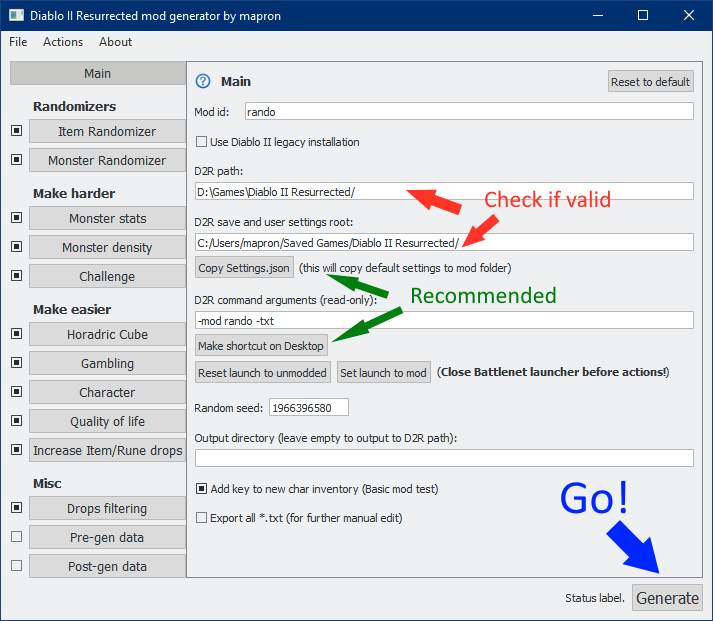
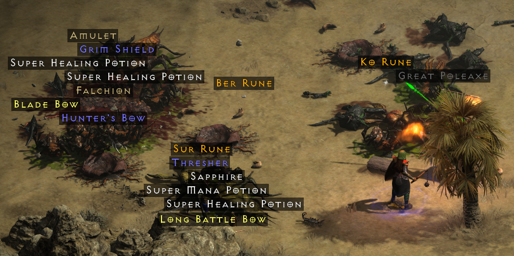

# Diablo 2 mod generator

Generator is inspired by [d2modmaker](https://github.com/tlentz/d2modmaker). It provides fast and easy way to create mod without any modding knowledge.  
Features included:  
- GUI-based desktop application with "one click and go" solution;
- Ability to adjust monster stats;
- Tune options to increase Set/Unique/Rare drops;
- Increase monster density and boss pack count to insane numbers;
- Last but not least, item randomizer - switch magic properties between Uniques, Runewords, Sets, Magic/Rare and even gems and runes!

# Quick start
  
Main Window  
1. Download zip archive from [releases page](https://github.com/mapron/d2modgen/releases);
2. Extract wherever you want and go inside extracted folder;
3. Run modgen.exe (see the screenshot);
4. Check if "D2R path" is filled correctly; if not, edit it manually to point "Diablo II Resurrected/" folder;
5. Optional; press "Copy Settings.json" to initialize new mod with your default game settings (music volume, etc);
6. Now you need to setup modded launch of D2R - that can be done either by creating the shortcut or modifying launch option in BNet launcher, choose what is suitable for you:  
a) Press "Make shortcut on Desktop", that will make "Diablo II - modname Mod" link on your Desktop;  
b) OR copy value from "D2R command arguments" and create shortcut by yourself, pointing to D2R.exe and use this as extra args;  
c) OR close Battlenet client, press "Set launch to mod" to setup game launch as modded by default and launch BNet again;  
d) OR make it manually, by going  "Settings near Play button" - "Game Settings" - "Diablo II Resurrected" - "Additional command line arguments" and paste string from "D2R commandline"  
7. Press "Generate" button;
9. Launch the game and go to offline tab mode. Create a new character and start;
10. If you done all correctly, character will have chest key in the inventory after creation.  

Now, go and play around with other settings, click "Generate" and restart D2R again!  
Note: all you offline character still exist in non-modded save folder.  
Note 2: mod do not affect online play in any way, you won't get banned for it.  
Note 3: if you want to return to unmodded, press "Reset launch to unmodded" (again, BNet must be closed when you press this button).

# How it looks like
  
High density setting in Lost City  
  
Random affixes set on gem with Randomizer  
  
That's and Eld rune I always wanted to see!  
  
Nice boots i found in Cold Plains Normal!  
  
Another GG find, Pelta Lunata! Trying to use balanced drops next time...  
  
A lot of features enabled here - more Boss drops, increased Uniques/drop count/Rune drops etc. Almost close to D3 drop count (please, dont go that far!)  

# Detailed description how everything works
1. Game (D2 and D2R) stores a lot of properties/balance of game cotent in tables - imagine an Excel spreadsheet or database table inside the game. One way to modify this data - provide a set of txt files (which are CSV - tab-separted). Starting with D2R, that can be done in a very simple way - creating a mod subfolder, so custom mod no not override the main game. d2modgen utilizes this feature.
2. Main game data located in "D2R folder", mod in "D2R folder/mod/modname/modname.mpq/"; save files stored in "User folder/Saved Games", mod save files (and games settings) stored in  "User folder/Saved Games/mods/modname". You can easily transfer your data between modded and non-modded versions (for example, shared storage).
3. To run the game in modded version, you need to provide command-line option, like "-mod rando -txt" will run D2R with mod "rando" enabled.
4. You can check "Export all .txt" checkbox, and have you own mod setup instead (mod folder is filled by D2R internal files).

# Feature tabs
  
Difficulty settings.  
First there are sliders to adjust monsters AR/Def/HP/Damage/XP. That will affect all monsters on all difficulties.  
Next, "Density" slider - that will affect increase of density of regular monsters (note that it is higly dependant on map and tiles; max density can be reached on open area tiles.)  
Boss packs slider icreate number of Champion/Uniques in zones; again, that also not a precise setting.  
Checkbox can be used to quickly setup boss count on Normal and Nightmare exactly the same as on Hell.  
And the last, you can adjust level area on all maps; note that max value of 85 is still used (so set to 20 to basically make all Hell 85 areas).  
  
  
  
Drops improvement.  
First 3 sliders are for increasing chance for Uniques/Sets/Rares. Note that it's not than accurate when you have already high chance (like killing low level monster with high MF).  
NoDrop slider provides ability to gradually reduce NoDrop parts (it basically similar to increasing players count in the game).  
"Increase Champion/Unique item count" make Unique bosses to drop 4 items instead of just 1, and Champions drop 2 items instead of one.  
"Increase Good TC" slider makes Gems/Runes/Rings/Amulets/Charms drop far more often compare to equipment.  
"Increase Runes chance" tunes Runes specifically compared to other jewellery.  
Switch Ber/Jah with Cham/Zod pretty descriptive: when game deside to drop Jah rune, it drops Zod instead.  
Final slider is when everything above is not satisfying and you really really want high runes to be more common. Please don't do that :).  
  
  
  
Randomizer. Firs you need to set topmost checbox to enable everything.  
Balance level - determine level difference to be used when selecting new properties for item/rune/etc. With '10' it will select between level-10 and level+5 at first, if there are few candidates, then it will select 0..level+5, and finally it will try fully random. In short, lower value = more balance in terms of original affix level and item level.  
Next four sliders set min/max amount of affixes on Uniques, Sets and RuneWords. Sets (whole bonus)/gems/runes will have 1 as minimum and maximum possible as maximum.  
Always perfect means simply minimum roll becomes maximum.  
Randomize magic/rare include modification of regular affixes - so they can include properties of any other item in the game.  
Same for last option for gems.  

# KnownIssues
1. If there is many dead bodies on the screen, some portals won't open (e.g. near Summoner). Workaround - go far away to another location, wait while corpses disappeared and then trigger the portal.
2. If charges spawned on a gem/rune, it will constantly update count on gem mouse hover. This glitch is fixes after gem is inserted in socket.
3. Game trying to render limited item label on the screen - if there are too many items, you will see only closest ones.
4. Some mods can be spawn on items that do not support them (like Replenish quantity on Amulet). (TODO - future releases)
5. You need to completely quit out of the game for Diablo 2 Resurrected, to mod changes apply. In Diablo 2 legacy, however, you can just reload save again without quitting.

# Q&A and Troubleshooting
If you encounter an issue (hang/crash) in generator itself, grab applog.txt (File->Browse to settings folder) (make sure to copy file just after the crash). Then create an issue and attach this file.  
NB: author do not respond for any issues in D2R itself (all on your own risk!). However, you can create an issue to address game problems if you know correct way to fix it.

# How to build from the source
Prerequisites:
1. **Qt 5.15 LTS**
2. **CMake 3.20**  (prior versions should be fine though).
3. **C++17 capable compiler**. Tested: MSVC 2019 16.11.  

If requirements are met, then go "cmake/build/build install". For windows platform, "build install" creates install in binary directory with all runtime dependencies.

# Contribute
1. follow clang-format rules in src/ directory;
2. ConfigPage(Someting).cpp is probably your main focus of interest for adding new rules. Either create new configpage file or edit existent one.

# Used thirdparty products
- (MIT) CascLib (https://github.com/ladislav-zezula/CascLib) is used for Blizzard CASC data storage read;
- (Zlib) Zlib library used internally by CascLib;
- (MIT) StormLib (https://github.com/ladislav-zezula/StormLib) is used for reading MPQ files.

# Third party components as non-distributed dependency
- Qt , https://www.qt.io/, GPL/LGPL/Commercial; components utilized by d2modgen are available under LGPL.

# License
Project source code is licensed under [MIT license](LICENSE).
