# Diablo 2 mod generator

Generator is inspired by [d2modmaker](https://github.com/tlentz/d2modmaker). It provides fast and easy way to create mod without any modding knowledge.  
Features included:  
- GUI-based desktop application with "one click and go" solution;
- Item randomizer - create new properties for Uniques, Runewords, Sets, Magic/Rare and even gems and runes!
- Monster randomizer - now any zone can have any monster! (balance taken into account);
- Increase monster density and boss pack count to insane numbers;
- Tired of finding High Runes? Bring drop levels to crazy amounts, adjust uniques, Runes and more;
- Ability to adjust monster stats;
- Make you life easier with dozens of quality-of-life features;  
  
  
See screenshots below to have a look what d2modgen supports - and you can get comprehensive help on each page by clicking help icon.  
If you interested in history of changes, [changelog is here](Changelog.md)

# Quick start
  
Main Window  
1. Download zip archive from [releases page](https://github.com/mapron/d2modgen/releases);
2. Extract wherever you want and go inside extracted folder;
3. Run modgen.exe (see the screenshot);
4. Check if "D2R path" is filled correctly; if not, edit it manually to point "Diablo II Resurrected/" folder;
5. Optional; press "Copy Settings.json" to initialize new mod with your default game settings (music volume, etc);
6. Now you need to setup modded launch of D2R - that can be done either by creating the shortcut or modifying launch option in BNet launcher, choose what is suitable for you:  
a) Press "Make shortcut on Desktop", that will make "Diablo II - modname Mod" link on your Desktop;  
b) OR copy value from "D2R command arguments" and create shortcut by yourself, pointing to D2R.exe and use this as extra args;  
c) OR close Battlenet client, press "Set launch to mod" to setup game launch as modded by default and launch BNet again;  
d) OR make it manually, by going  "Settings near Play button" - "Game Settings" - "Diablo II Resurrected" - "Additional command line arguments" and paste string from "D2R commandline"  
7. Press "Generate" button;
9. Launch the game and go to offline tab mode. Create a new character and start;
10. If you done all correctly, character will have chest key in the inventory after creation.  

Now, go and play around with other settings, click "Generate" and restart D2R again!  
Note: all you offline character still exist in non-modded save folder.  
Note 2: mod do not affect online play in any way, you won't get banned for it.  
Note 3: if you want to return to unmodded, press "Reset launch to unmodded" (again, BNet must be closed when you press this button).

# Start new config from preset
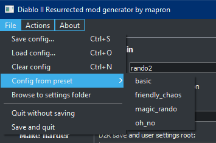  
There are 4 premade configs to quickly start rando!  
Go to [Presets readme](presets/readme.txt) to learn more about them.  

# How it looks like
  
High density setting in Lost City  
  
Random affixes set on gem with Randomizer  
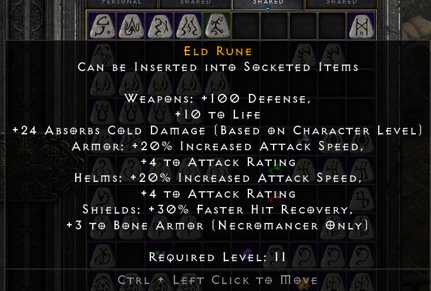  
That's and Eld rune I always wanted to see!  
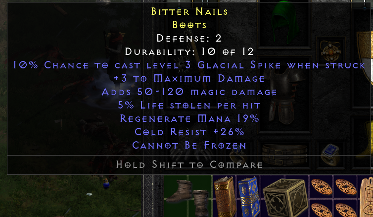  
Nice boots i found in Cold Plains Normal!  
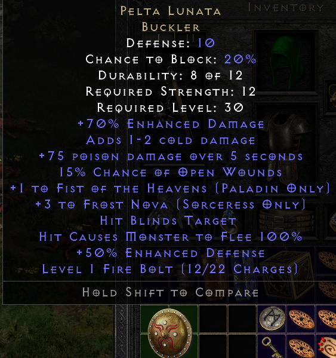  
Another GG find, Pelta Lunata! Trying to use balanced drops next time...  
  
A lot of features enabled here - more Boss drops, increased Uniques/drop count/Rune drops etc. Almost close to D3 drop count (please, dont go that far!)  

# Detailed description how everything works
1. Game (D2 and D2R) stores a lot of properties/balance of game cotent in tables - imagine an Excel spreadsheet or database table inside the game. One way to modify this data - provide a set of txt files (which are CSV - tab-separted). Starting with D2R, that can be done in a very simple way - creating a mod subfolder, so custom mod no not override the main game. d2modgen utilizes this feature.
2. Main game data located in "D2R folder", mod in "D2R folder/mod/modname/modname.mpq/"; save files stored in "User folder/Saved Games", mod save files (and games settings) stored in  "User folder/Saved Games/mods/modname". You can easily transfer your data between modded and non-modded versions (for example, shared storage).
3. To run the game in modded version, you need to provide command-line option, like "-mod rando -txt" will run D2R with mod "rando" enabled.
4. You can check "Export all .txt" checkbox, and have you own mod setup instead (mod folder is filled by D2R internal files).

# Feature tabs
For each tab, just click or hover over question button (?) to get help about features on each page.  
Also, as you noticed, support for Dark and Light theme is available - choose what you prefer in Actions -> Theme.

#### Randomize items  
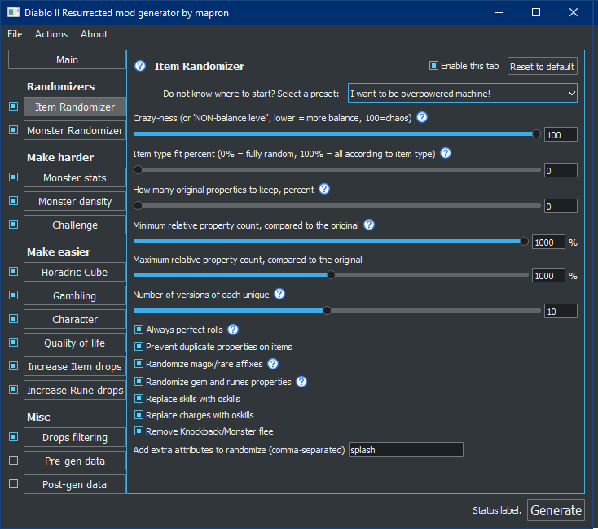  

#### Randomize monsters  
  

#### Randomize some character skills  
  

#### Change monster stats  
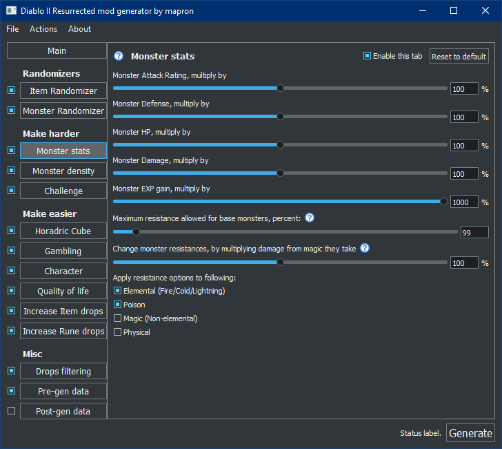  

#### Increase monster and elites density
  

#### Challenge difficulty  
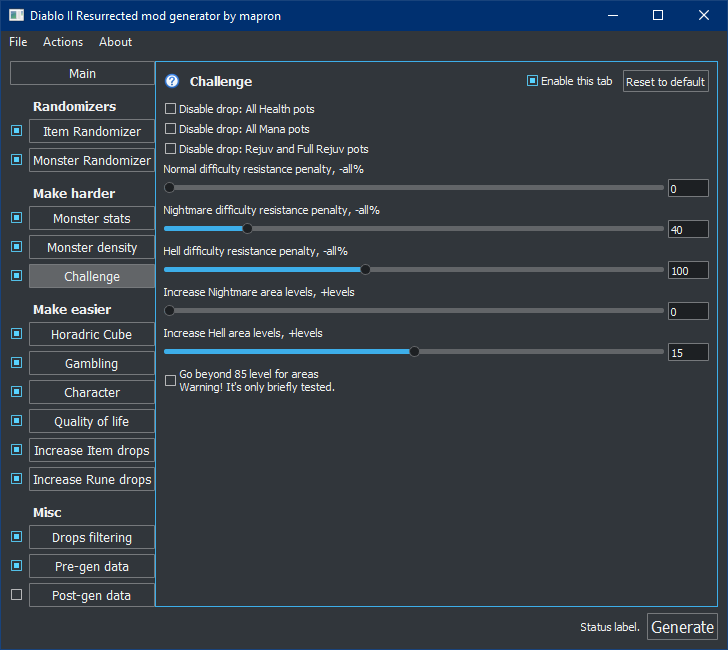  

#### Cube recipes to blaze through  
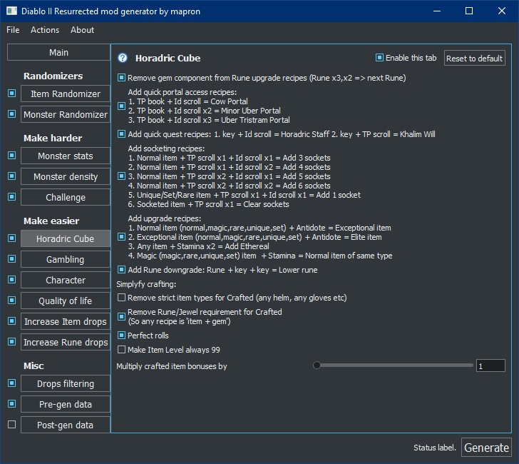  

#### Easier Gambling
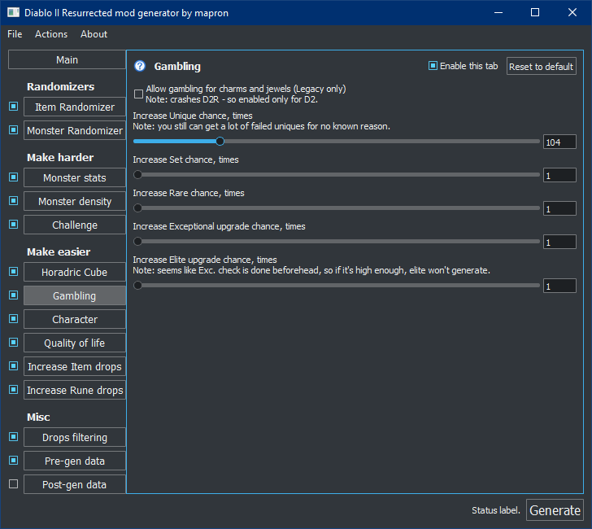  

#### Character
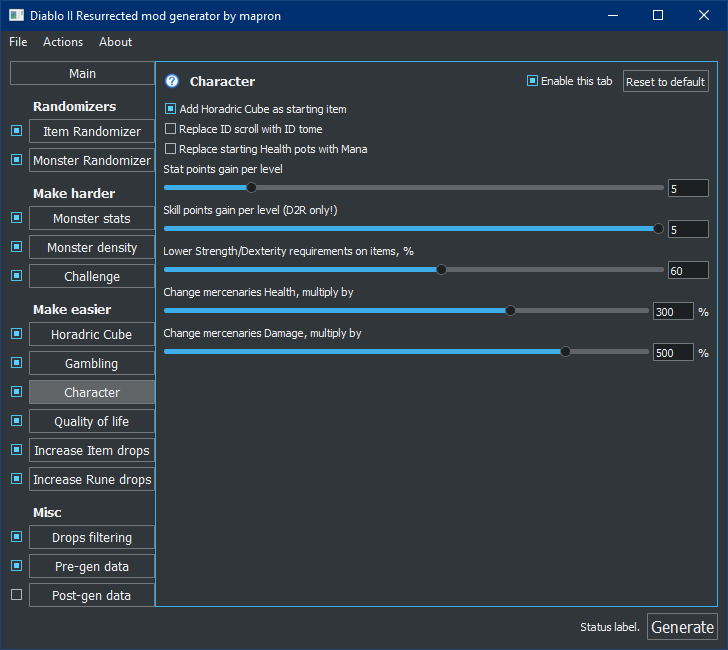  

#### Quality of life
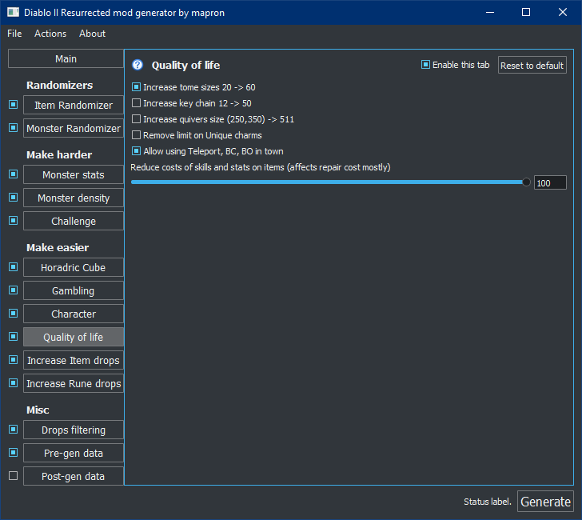  

#### Increase item drops
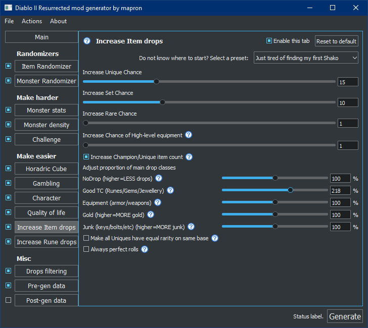  

#### Increase Rune drops
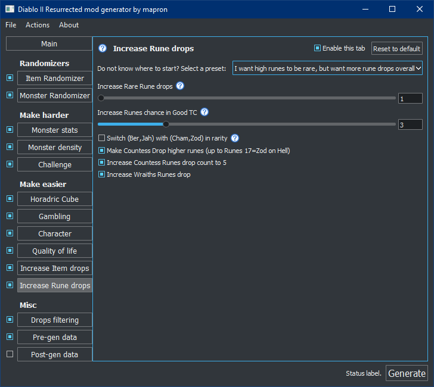  

#### Make everything perfect
  

#### Filter your drops
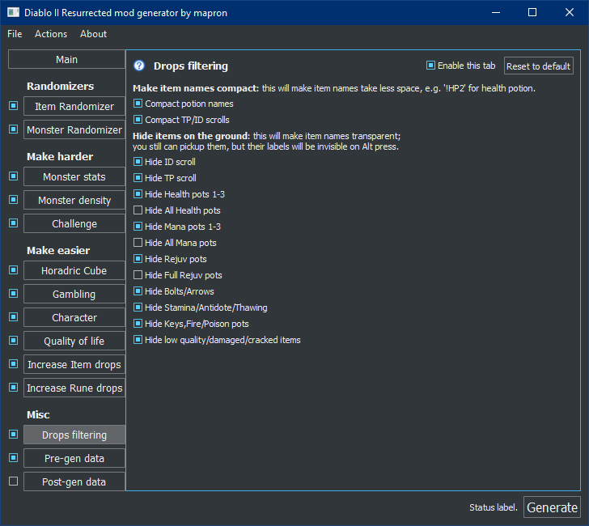  

#### Merge with other mods or custom files
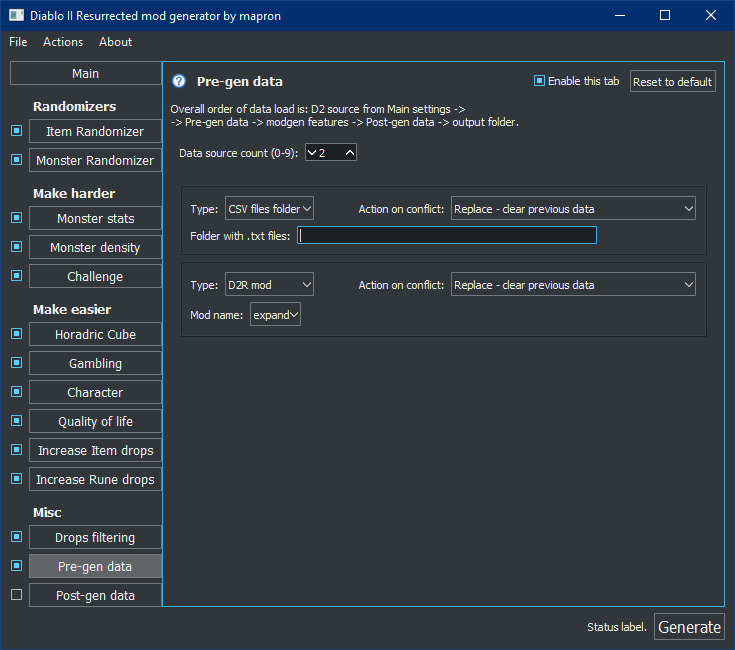  


# Using commandline
You also can run d2modgen in commandline mode (without UI). Two commands are supported:  
```d2modgen.exe --generate /path/to/config.json```  
will run generation using specific json file;  
```d2modgen.exe --generate```  
will generate output using default application config.  
Warning: please note, if any error dialog appear, it willbe shown and block execution. So use this with already well formed configuration.

# KnownIssues
1. If there is many dead bodies on the screen, some portals won't open (e.g. near Summoner). Workaround - go far away to another location, wait while corpses disappeared and then trigger the portal.
2. If charges spawned on a gem/rune, it will constantly update count on gem mouse hover. This glitch is fixes after gem is inserted in socket.
3. Game trying to render limited item label on the screen - if there are too many items, you will see only closest ones. Use DropFiltering tab feature.
4. You need to completely quit out of the game for Diablo 2 Resurrected, to mod changes apply. In Diablo 2 legacy, however, you can just reload save again without quitting.

# Q&A and Troubleshooting
If you encounter an issue (hang/crash) in generator itself, grab applog.txt (File->Browse to settings folder) (make sure to copy file just after the crash). Then create an issue and attach this file.  
NB: author do not respond for any issues in D2R itself (all on your own risk!). However, you can create an issue to address game problems if you know correct way to fix it.

# How to build from the source
Prerequisites:
1. **Qt 5.15 LTS**
2. **CMake 3.20**  (prior versions should be fine though).
3. **C++17 capable compiler**. Tested: MSVC 2019 16.11.  

If requirements are met, then go "cmake/build/build install". For windows platform, "build install" creates install in binary directory with all runtime dependencies.

# Contribute
1. follow clang-format rules in src/ directory;
2. ConfigPage(Someting).cpp is probably your main focus of interest for adding new rules. Either create new configpage file or edit existent one.

# Used thirdparty products
- (MIT) CascLib (https://github.com/ladislav-zezula/CascLib) is used for Blizzard CASC data storage read;
- (Zlib) Zlib library used internally by CascLib;
- (MIT) StormLib (https://github.com/ladislav-zezula/StormLib) is used for reading MPQ files.
- (MIT) BreezeStylesheet (https://github.com/Alexhuszagh/BreezeStyleSheets) for theme support.

# Third party components as non-distributed dependency
- Qt , https://www.qt.io/, GPL/LGPL/Commercial; components utilized by d2modgen are available under LGPL.

# License
Project source code is licensed under [MIT license](LICENSE).
